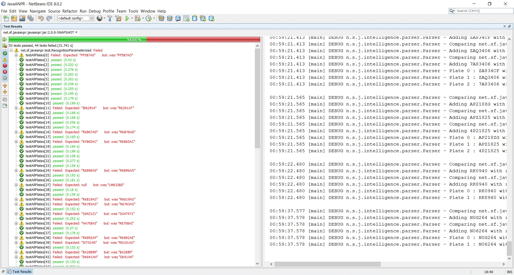

==RuVaZi

==Spørgsmål og svar

==Explain the purpose of the Test (what the original test exposed, and what your test expose):

Meningen med testen er at tjekke om programmet er i stand til at genkende forskellige nummerplader ud fra en mappe med billeder af forskellige bilnummerplader. 
Der er to test, en der tester en enkelt nummerplade, og en der tester alle nummerpladerne, men den anden test tester ikke rigtigheden af resultatet kodens tolkning af nummerpladerne.

==Explain about Parameterized Tests in JUnit and how you have used it in this exercise:

Med parameteret (parameterized) tests kan man lave simpel testkode uden at skulle skrive en masse. Man kan med parameteret test lave lister med test input/output. Dette har været meget rart at bruge i en opgave som denne med at test mange billeder af forskellige nummer plader.

==Explain the topic Data Driven Testing, and why it often makes a lot of sense to read test-data from a file:

Data-Driven-Testing er en måde hvorpå man får test dataen fra en ekstern part, og man er ikke afhængig af at rette i koden for at test ny data.
Data Driven Testing gør at man kan tilføje nye test cases hurtigere og lettere. Man slipper også med DDT at hardcode en masse data.

==Your answers to the question; whether what you implemented was a Unit Test or a JUnit Test, the problems you might have discovered with the test and, your suggestions for ways this could have been fixed.. :

Jeg vil mene at det er en JUnit Test, da det er java kode jeg har arbejde med.
En unit test fin beskrevet med følgende citat: ”A unit test is a piece of code written by a developer that executes a specific functionality in the code to be tested and asserts a certain behavior or state.” 
(http://www.vogella.com/tutorials/JUnit/article.html):

==The steps you took to include Hamcrest matchers in the project, and the difference they made for the test

I pom.xml under dependencys blev følgende added:
<dependency>
    <groupId>org.hamcrest</groupId>
    <artifactId>hamcrest-library</artifactId>
    <version>1.3</version>
    <scope>test</scope>
</dependency>
Tests er blevet lettere at læse med hamcrest.

added paramitized Test. See screen Shot for prof of working:

_________________________________________________________________________________________________________________________________
== JavaANPR

image:https://travis-ci.org/oskopek/javaanpr.svg?branch=master["Build Status", link="https://travis-ci.org/oskopek/javaanpr"]
image:https://coveralls.io/repos/oskopek/javaanpr/badge.png?branch=master["Coverage Status", link="https://coveralls.io/r/oskopek/javaanpr?branch=master"]
image:https://www.ohloh.net/p/javaanpr/widgets/project_thin_badge.gif["Ohloh widget", link="https://www.ohloh.net/p/javaanpr"]

*Original author*: Copyright (C) 2006-2007 Ondrej Martinsky. All rights reserved.

Licensing details for JavaANPR are in the file LICENCE.

This work is a derivative of JavaANPR created by Ondrej Martinsky, for his original work visit: http://javaanpr.sourceforge.net/

=== Screenshot

image:./docs/img/screenshot.png["JavaANPR GUI", scaledwidth="25%"]

=== Building

* *Recommended*: `mvn clean install -DskipTests`
* To run *unit tests*: `mvn clean test`
* To run *functional tests* too: `mvn clean verify -Pit`
* To *clean*, run: `mvn clean`
* To run the *example GUI*: `mvn exec:java`

=== Getting help

* Post questions or comments on our Google Groups link:https://groups.google.com/d/forum/javaanpr[mailing list]
* Join our *IRC channel*: Join *#javaanpr* on *irc.freenode.net*

=== Info

JavaANPR uses http://semver.org/[semantic versioning].

== Documentation
The state of documentation of JavaANPR is unsatisfactory.
The bachelor thesis of the original author can serve very well for current needs:
http://javaanpr.sourceforge.net/anpr.pdf[Algorithmic and Mathematical Principles of Automatic Number Plate Recognition Systems]

=== Contributing
*Everyone* is encouraged to help improve this project.

Here are some ways *you* can contribute:

* by using alpha, beta, and pre-release versions
* by reporting bugs
* by suggesting new features
* by translating to a new language
* by writing or editing documentation
* by writing specifications
* by writing code (*no patch is too small*: fix typos, add comments, clean up inconsistent whitespace)
* by refactoring code
* by closing https://github.com/oskopek/javaanpr/issues[issues]
* by reviewing patches

=== Submitting an Issue
We use the https://github.com/oskopek/javaanpr/issues[GitHub issue tracker] to track bugs and features. Before
submitting a bug report or feature request, check to make sure it hasn't
already been submitted. When submitting a bug report, please include a https://gist.github.com/[Gist]
that includes a stack trace and any details that may be necessary to reproduce
the bug, including your Java version and operating system.

=== Submitting a Pull Request
1. http://help.github.com/fork-a-repo/[Fork the repository.]
2. http://learn.github.com/p/branching.html[Create a topic branch.]
3. Implement your feature or bug fix.
4. Run +mvn clean install+. If the tests fail, return to step 3.
5. If applicable, add tests for your feature or bug fix.
6. Add, commit, and push your changes.
7. http://help.github.com/send-pull-requests/[Submit a pull request.]
